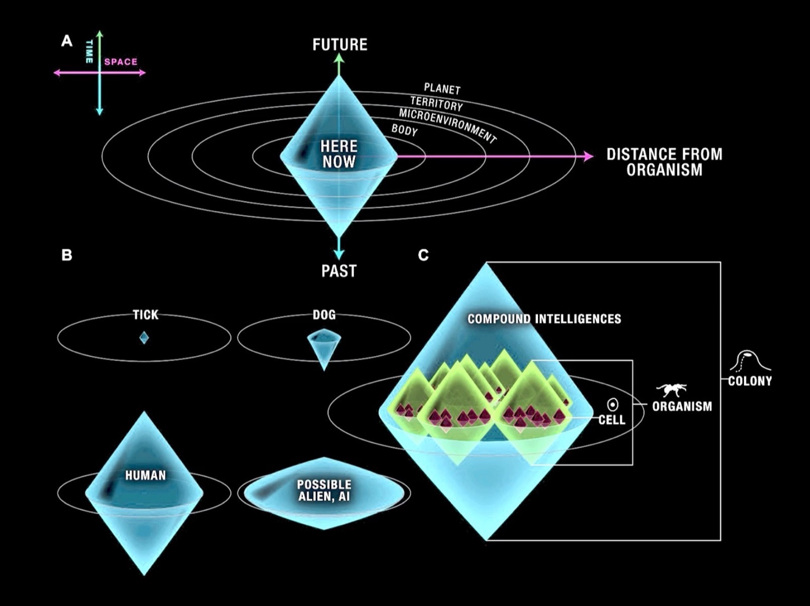

# Cognitive Ledger
Deepening your agent's cognitive lightcone with a persistent, hybrid markdown+embeddings based memory system. Includes dreams-based consolidation (`electric sheep`), a drop-in `/notes` skill for agents, and tools for bootstrapping from existing notes trees.  



## What
A structured, file-based memory system for AI agents. Small atomic notes (facts, preferences, goals, open loops, concepts, identity) stored as markdown with YAML frontmatter. Searchable, versionable, and designed to fit inside context windows. Includes a feedback loop that captures retrieval signals to improve ranking over time.

## Why
Language models forget everything between sessions. The Cognitive Ledger gives them a persistent, inspectable memory - not by stuffing raw chat logs into the context window, but by distilling conversations into atomic, retrievable notes. Each note captures one durable idea (a decision, a preference, a goal, an open question) so that any agent can resume any thread by searching the ledger instead of re-reading the entire conversation history. The result is continuity across sessions, agents, and tools without blowing up context budgets.

## Quick Start

```bash
git clone https://github.com/<you>/cognitive-ledger.git
cd cognitive-ledger
./scripts/setup-venv.sh
./scripts/ledger init                # one-command setup
./skills/install-skill.sh            # install /notes skill for your agents
```

That's it. The `init` command creates the full directory structure, templates,
config, and initial indices. Optional flags:

```bash
./scripts/ledger init --voice-dna ~/voice-profile.json   # import your writing voice
./scripts/ledger init --source-notes-dir ~/notes          # set source for ingest
```

If you use the bundled `/notes` skill, set `LEDGER_SOURCE_NOTES_DIR` and `LEDGER_ROOT` in your shell startup file so the skill can find both trees consistently:

```bash
export LEDGER_SOURCE_NOTES_DIR="$HOME/path/to/notes"
export LEDGER_ROOT="$HOME/path/to/cognitive-ledger"
export LEDGER_NOTES_DIR="$LEDGER_ROOT/notes"
source ~/.zshrc
```

### Configure (optional)

Edit `config.yaml` in the repo root:

```yaml
# config.yaml
source_notes_dir: ~/Code/notes
# auto_file_synthesis: false  # set true to auto-file query syntheses
```

All values are optional - defaults work out of the box. Environment variables
(`LEDGER_ROOT`, `LEDGER_NOTES_DIR`, etc.) override the config file.

### Set up hooks (recommended)

Add to `.claude/settings.json`:

```json
{
  "hooks": {
    "SessionStart": [
      {"type": "command", "command": "bash scripts/hooks/session_start.sh"}
    ],
    "Notification": [
      {"type": "command", "command": "bash scripts/hooks/session_end_capture.sh"}
    ]
  }
}
```

### Try it

Invoke `/notes` in your agent session:

1. Read `notes/08_indices/context.md` for existing context
2. Ask targeted questions about what you want to capture
3. Write atomic notes to the ledger (and optionally to your notes tree)

Or try `./scripts/ledger briefing` for a daily status overview.

## Plugging Into an Existing Notes Repository

You don't need to move your notes. Bootstrap the ledger inside your existing notes tree:

```bash
# Generic markdown notes
ledger-obsidian bootstrap --root ~/Code/notes
ledger-obsidian import --root ~/Code/notes

# Obsidian vault
ledger-obsidian init --vault /path/to/your/obsidian-vault
ledger-obsidian import --vault /path/to/vault
```

This creates a `cognitive-ledger/` subdirectory inside your notes tree. Source notes are never edited.

### Keeping it in sync

```bash
ledger-obsidian watch --vault /path/to/vault          # live sync
ledger-obsidian daemon start --vault /path/to/vault    # macOS background service
ledger-obsidian queue sync --vault /path/to/vault      # manual sync
ledger-obsidian doctor --vault /path/to/vault          # health check
```

## Indexing and Retrieval

### Build indices

```bash
./scripts/sheep index                    # rebuild metadata index
./scripts/sheep lint                     # validate frontmatter
./scripts/sheep status                   # time since last consolidation
```

### Query your notes

```bash
./scripts/ledger query "calendar constraints" --scope all --limit 8
./scripts/ledger query "calendar constraints" --bundle    # context-window-friendly output
./scripts/ledger loops                                    # list open loops
./scripts/ledger loops --interactive                      # progressive disclosure
./scripts/ledger context --format boot                    # session boot payload
```

### Semantic search (optional)

```bash
./scripts/ledger embed build --target ledger --backend local --model TaylorAI/bge-micro-v2
./scripts/ledger query "calendar constraints" --retrieval-mode semantic_hybrid --embed-backend local
```

### Eval and A/B testing

```bash
./scripts/ledger eval --cases notes/08_indices/retrieval_eval_cases.yaml --k 3
./scripts/ledger_ab --baseline-ref main --candidate-ref HEAD --runs 5
```

## Folder Layout

```
notes/
  00_inbox/         temporary capture (cleared on consolidation)
  01_identity/      core identity: mission, beliefs, models, strategies, narratives (id__*.md)
  02_facts/         stable truths (fact__*.md)
  03_preferences/   user preferences (pref__*.md)
  04_goals/         long-term objectives (goal__*.md)
  05_open_loops/    unresolved items (loop__*.md)
  06_concepts/      definitions and frameworks (concept__*.md)
  07_projects/      project-specific subfolders
  08_indices/       derived indices (timeline, tags, eval cases, signals)
  09_archive/       superseded notes
```

Each note has YAML frontmatter with `created`, `updated`, `tags`, `confidence`, `source`, `scope`, and `lang`. Identity notes also have `identity_type`. See `schema.yaml` for the full spec and `templates/` for starter templates.

## Identity Layer

Identity notes in `notes/01_identity/` capture who the user is — mission, beliefs, mental models, decision strategies, and personal narratives. These are high-signal, small files (max 5) that provide rich context for interpreting requests. They receive a retrieval score boost and are loaded automatically at session start.

```bash
./scripts/ledger context --format identity   # list identity notes
./scripts/ledger notes --type identity       # browse identity notes
```

## Signal Feedback Loop

The ledger captures feedback signals — retrieval hits/misses, corrections, affirmations, and ratings — to improve retrieval ranking over time. Signals are stored as append-only JSONL and summarized into per-note scores that feed back into retrieval.

```bash
./scripts/ledger signal add --type retrieval_hit --query "deploy" --note notes/02_facts/fact__k8s.md
./scripts/ledger signal add --type correction --note notes/03_preferences/pref__x.md --detail "outdated"
./scripts/ledger signal add --type rating --rating 8
./scripts/ledger signal summarize            # rebuild signal_summary.json
./scripts/ledger signal stats                # counts, top notes, coverage gaps
```

Signal scoring is disabled by default (`score_weight_signal: 0.0`) until enough data accumulates. Enable via `config.yaml` once you have 20+ signals.

## Session Lifecycle Hooks

Hook scripts under `scripts/hooks/` automate common session patterns:

- **`session_start.sh`** — loads boot context (identity notes, open loops, maintenance status, signal stats)
- **`post_write.sh`** — appends timeline entries after note operations
- **`session_end.sh`** — flushes signal summary, reports session activity

```bash
bash scripts/hooks/session_start.sh          # manual invocation
```

For Claude Code, configure hooks in `.claude/settings.json`. See `AGENTS.md` for integration details.

## Consolidation ("Electric Sheep")

Periodic maintenance keeps the ledger coherent as it grows:

```bash
./scripts/sheep sync --check && ./scripts/sheep sync --apply
./scripts/sheep sleep
```

Sleep merges duplicates, promotes patterns into stable notes, updates indices, and tightens open loops.

## TUI

A terminal interface for browsing and editing notes:

```bash
./.venv/bin/python -m tui              # run from venv
# or
./tui/build-tui.sh && ./tui/dist/ledger-tui   # standalone binary
```

Key bindings: `j/k` navigate, `Enter` select, `1-5` filter by type, `/` search, `e` edit, `g` graph, `q` quit.

## Agent Integration

Agents should read `AGENTS.md` for the full protocol — golden rules, note conventions, write triggers, and the operating loop. The short version:

- Search before you write (`rg`, `fd`)
- One idea per file
- Never store raw chat logs
- Append to `notes/08_indices/timeline.md` after every note operation

## Python Environment

```bash
./scripts/setup-venv.sh                                  # base + dev + embeddings
./scripts/setup-venv.sh --python python3.12 --recreate   # force interpreter
./scripts/setup-venv.sh --minimal                        # base only
```

All scripts auto-activate `.venv` when present.
