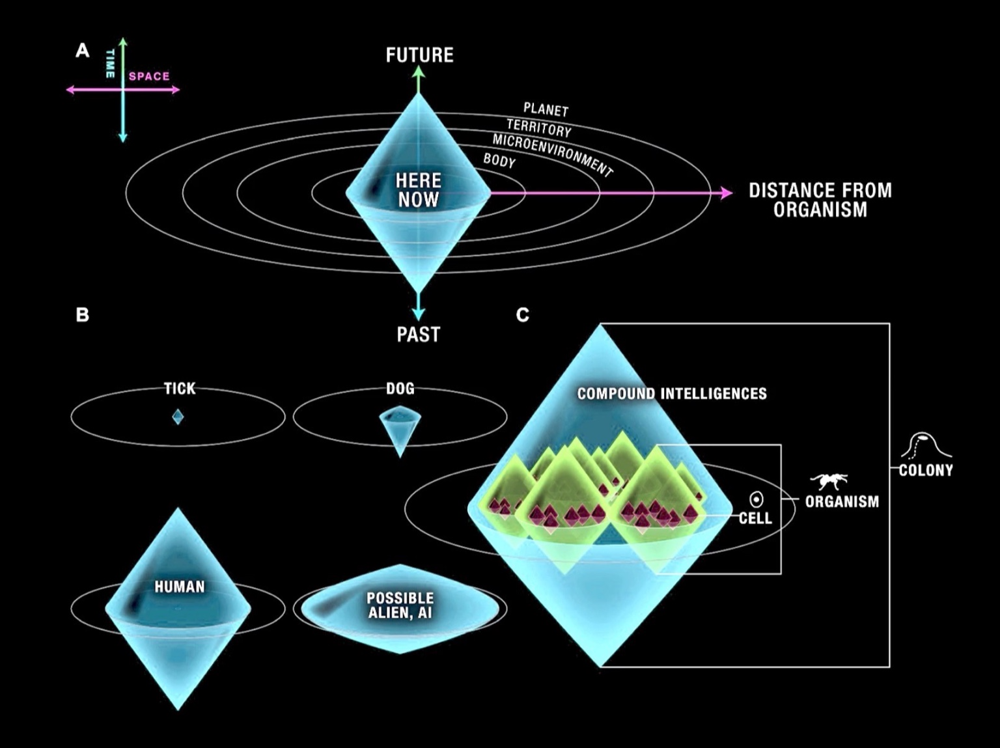
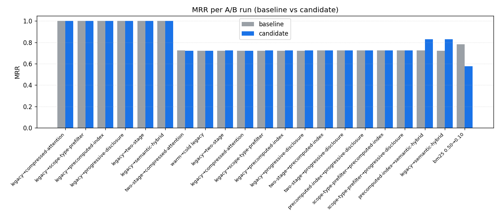
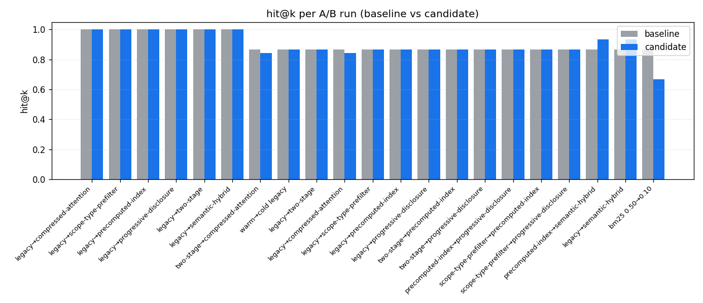
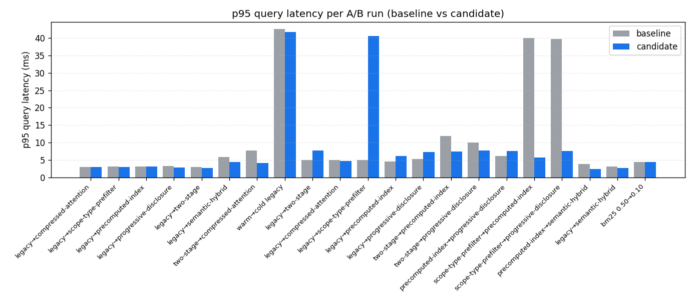

# Cognitive Ledger
Deepening your agent's cognitive lightcone with a persistent, hybrid markdown+embeddings based memory system. Includes dreams-based consolidation (`electric sheep`), a drop-in `/notes` skill for agents, and tools for bootstrapping from existing notes trees.  



## CLI contract

The `ledger` and `sheep` binaries follow a single CLI contract: stable
output classes, a 0-5 exit-code taxonomy, and action envelopes (see
`ledger/conventions.py`). They work standalone. Obsidian vault workflows
use `ledger import obsidian {subcommand}`.

## What
A structured, file-based memory system for AI agents. Small atomic notes (facts, preferences, goals, open loops, concepts, identity) stored as markdown with YAML frontmatter. Searchable, versionable, and designed to fit inside context windows. Includes a feedback loop that captures retrieval signals to improve ranking over time.

## Why
Language models forget everything between sessions. The Cognitive Ledger gives them a persistent, inspectable memory - not by stuffing raw chat logs into the context window, but by distilling conversations into atomic, retrievable notes. Each note captures one durable idea (a decision, a preference, a goal, an open question) so that any agent can resume any thread by searching the ledger instead of re-reading the entire conversation history. The result is continuity across sessions, agents, and tools without blowing up context budgets.

## Quick Start

```bash
brew tap damsleth/tap
brew install cognitive-ledger
ledger init --root "$HOME/.config/cognitive-ledger" \
  --ledger-notes-dir ~/Code/ledger-notes \
  --source-notes-dir ~/Code/notes
```

`ledger init` scaffolds the notes tree (`01_identity/` … `09_archive/`) and emits templates + schema into `--root`, and writes your config to `$XDG_CONFIG_HOME/ledger/config.yaml` (i.e. `~/.config/ledger/config.yaml`). The config is created with `first_run: true` so the session-start hook can inject setup guidance on the first agent session. The package, the config, and the ledger folder are independent — the source checkout is not needed at runtime.

Optional flags:

```bash
ledger init --voice-dna ~/voice-profile.json   # import your writing voice
ledger paths                                    # verify resolved locations
```

## Agent Skill

The `/notes` agent skill that drives this ledger lives in a separate repo:

> https://github.com/damsleth/SKILLS

Clone it and run the installer to symlink the skill into your agent's user-level skills folder (Claude, Codex, Copilot):

```bash
git clone https://github.com/damsleth/SKILLS.git
cd SKILLS
./install-skill.sh        # interactive checkbox UI
```

The skill's first run will brew-install this package automatically if it's missing - so you can install in either order.

### Configure (optional)

Edit your user config at `~/.config/ledger/config.yaml` (override the directory
with `$XDG_CONFIG_HOME`). See `config.sample.yaml` in this repo for all keys:

```yaml
# ~/.config/ledger/config.yaml
ledger_notes_dir: ~/Code/ledger-notes
source_notes_dir: ~/Code/notes
# auto_file_synthesis: false  # set true to auto-file query syntheses
```

Environment variables (`LEDGER_ROOT`, `LEDGER_NOTES_DIR`, etc.) override the
config file.

### Set up hooks (recommended)

Add to `.claude/settings.json`:

```json
{
  "hooks": {
    "SessionStart": [
      {"type": "command", "command": "bash scripts/hooks/session_start.sh"}
    ],
    "Notification": [
      {"type": "command", "command": "bash scripts/hooks/session_end_capture.sh"}
    ]
  }
}
```

### Try it

Invoke `/notes` in your agent session:

1. Read `$(ledger paths --field ledger_notes_dir)/08_indices/context.md` for existing context
2. Ask targeted questions about what you want to capture
3. Write atomic notes to the ledger (and optionally to your notes tree)

Or try `ledger briefing` for a daily status overview.

## Plugging Into an Existing Notes Repository

You don't need to move your notes. Bootstrap the ledger inside your existing notes tree:

```bash
# Generic markdown notes
ledger import folder import --root ~/Code/notes
ledger import folder doctor --root ~/Code/notes

# Obsidian vault
ledger import obsidian init --vault /path/to/your/obsidian-vault
ledger import obsidian bootstrap --vault /path/to/vault
ledger import obsidian import --vault /path/to/vault
```

This creates a `cognitive-ledger/` subdirectory inside your notes tree. Source notes are never edited.

### Keeping it in sync

```bash
ledger import obsidian watch --vault /path/to/vault          # live sync
ledger import obsidian daemon start --vault /path/to/vault    # macOS background service
ledger import obsidian queue sync --vault /path/to/vault      # manual sync
ledger import obsidian doctor --vault /path/to/vault          # health check
```

### Create a note

`ledger notes add` writes to `00_inbox/` by default. Pass `--no-inbox` when the
type is already decided and the note can land directly in its typed folder.

```bash
ledger notes add --type fact "The deployment window is Thursday."
ledger notes add --type loop --no-inbox \
  --link fact__deployment_policy \
  "Confirm the Thursday deployment window."
```

Direct loops include `status: open` and a `## Next action` checkbox, so the
tool's own `ledger sleep lint` accepts what it writes. Bare `--link` values
become `[[wikilinks]]`; URLs and explicit Markdown links pass through unchanged.

## Indexing and Retrieval

### Build indices

```bash
ledger sleep index                    # rebuild metadata index
ledger sleep lint                     # validate frontmatter
ledger sleep status                   # time since last consolidation
```

### Query your notes

Three detail levels let agents control the cost/detail tradeoff:

```bash
# Index view - compact scan (~20-30 tokens per result)
ledger query "calendar constraints" --scope all --limit 8 --view index

# Context view (default) - statements, snippets, tags (~80-120 tokens)
ledger query "calendar constraints" --scope all --limit 8

# Detail view - full bodies, score components (~200-1000 tokens)
ledger query "calendar constraints" --scope all --limit 8 --view detail

# Bundle mode - context-window-friendly excerpts within a word budget
ledger query "calendar constraints" --bundle

# Temporal query - notes valid on a given date (widens to include 09_archive)
ledger query "deployment policy" --as-of 2025-06-01

# Change window - notes created/updated since a date (composes with --as-of)
ledger query "deployment policy" --changed-since 2026-06-01

# Other
ledger loops                                    # list open loops
ledger context --format boot                    # session boot payload
ledger changed --since 2026-06-01 --type loops  # timeline digest of changes
```

`--view detail` and the `--json` envelope also include a **trust verdict**
(`high`/`medium`/`low` + reason) per result, derived from confidence,
affirmations, supersession, and contradiction flags. It is display-only and
never changes result order (toggle with `show_trust_verdict`).

### Ask a question (grounded synthesis)

`ledger answer` retrieves the most relevant notes and synthesizes a cited prose
answer (citations are note paths). The default backend is `dummy` (offline,
deterministic); configure `synth_backend` (`claude`/`ollama`/`subprocess`) for
real synthesis. Source bodies are private-scrubbed before they reach the model.

```bash
ledger answer "what did I decide about the scoring weights?"
ledger answer "open questions on deployment" --limit 5 --backend claude --json
```

### Use the ledger from an MCP client (Claude Desktop, Cursor, …)

`ledger mcp` runs a stdio Model Context Protocol server exposing the ledger's
read verbs (query, recall-as-of, changed-since, context, answer). Install the
extra and point your client at it:

```bash
pip install 'cognitive-ledger[mcp]'
# client config: command = "ledger", args = ["mcp"]
ledger mcp --allow-write    # also expose ledger_remember (captures to inbox)
ledger mcp --with-yaams     # also expose a yaams_query tool (tier-1 search)
```

Every tool response passes a private-content egress gate; writes (when enabled)
land in the inbox for human triage, never directly in typed folders.

### Semantic search (recommended)

Build the embedding index to activate `semantic_hybrid` (the default retrieval mode). Without this, queries fall back to `precomputed_index`.

```bash
ledger embed build --target ledger --backend local --model TaylorAI/bge-micro-v2
ledger embed status --target ledger    # verify index exists
ledger embed search --query "deploy window" --json     # search the built index

# Batch mode: JSONL requests on stdin, one JSON result per line on stdout,
# in input order. The encoder loads once for the whole batch — use this
# instead of one `ledger embed search` subprocess per query (yaams promote
# dedup does). A bad line emits {"error": "..."} and the batch continues.
printf '%s\n' '{"query": "deploy window"}' '{"query": "scoring weights", "limit": 3}' \
  | ledger embed search --batch
```

**Rebuild the index after adding notes.** In `semantic_hybrid` the candidate pool
is drawn from the embedding index first, so a note that has not been embedded
never enters it — lexical overlap cannot rescue it. The effect is bimodal, not
gradual: the note is simply unreachable until you rebuild, and then it ranks
normally. Import, triage, `notes add`, and hand edits all open this window.

`ledger query` warns on stderr when notes are newer than the index, so you are
not left concluding that retrieval is bad when the index is merely stale:

```bash
ledger sleep index    # regenerates derived indices *and* the semantic index
```

Optional ranking mechanisms (all off by default; enable after A/B validation):

| Mechanism | Config key | CLI | Notes |
|---|---|---|---|
| Prior score (cold-start) | `prior_enabled: true` (default on) | — | Adds confidence + recency + relevance nudge before signals accrue |
| PRF query expansion | `prf_enabled: true` | `--prf` | Rocchio expansion on dense path; keep off until `ledger ab run` proves improvement |
| RRF fusion | `fusion: rrf` | — | Merges lexical + semantic rank lists; keep `weighted_sum` until A/B validation |

### Eval and A/B testing

```bash
ledger eval --cases "$(ledger paths --field ledger_notes_dir)/08_indices/retrieval_eval_cases.yaml" --k 3
ledger ab run --baseline-ref main --candidate-ref HEAD --runs 5     # uses ledger_notes_dir from config.yaml
ledger ab run --corpus ~/Code/ledger-notes --baseline-ref main --candidate-ref HEAD --runs 5

# Config A/B on a single ref (e.g. validate a signal weight before flipping it).
# --candidate-env / --baseline-env take LEDGER_* env-var names; the values
# reach BOTH the eval and the query probes and are echoed back in the report
# (the "Config Overrides" table shows requested vs. applied).
ledger ab run --baseline-ref HEAD --candidate-ref HEAD \
  --candidate-env LEDGER_WEIGHT_SIGNAL=0.1 --runs 5
```

`ledger ab loop` runs the autonomous propose → screen → holdout → accept loop
over a YAML search space. Every trial — rejected ones included — also updates a
persistent, WikiSkill-style wiki under `<out-dir>/wiki/` (per-param impact
tracker, verdicts, and an append-only evolution log) that the proposer consults
to prioritize promising parameters and stop re-exploring consistently failing
ones. Pass `--no-wiki` for blind coordinate descent. See `docs/wikiskill.md`.

`--baseline-mode` / `--candidate-mode` default to your **configured**
`retrieval_mode` (e.g. `semantic_hybrid`), not `legacy`; pass the flags
explicitly to benchmark a different mode. When both refs resolve to the same
commit, the harness probes that commit's code (building a worktree if it is not
the currently checked-out HEAD); a ref that does not exist is refused with a
clear error rather than silently probing the working tree.

### Retrieval Mode A/B Results

All modes were benchmarked against `legacy` on the ledger corpus (5 runs each). `semantic_hybrid` is the default and falls back to `precomputed_index` when embeddings are unavailable.

| Mode | MRR | hit@1 | hit@k | p95 (ms) | Decision | Status |
|---|---|---|---|---|---|---|
| **semantic_hybrid** | **0.830** | **0.733** | **0.933** | 2.4 | beneficial (+0.108 MRR) | **default** (falls back to precomputed_index without embeddings) |
| precomputed_index | 0.726 | 0.578 | 0.867 | 6.1 | beneficial (+0.004 MRR) | fallback default |
| progressive_disclosure | 0.725 | 0.578 | 0.867 | 7.3 | beneficial (+0.004 MRR) | available |
| two_stage | 0.725 | 0.578 | 0.867 | 7.7 | beneficial (+0.004 MRR) | available |
| scope_type_prefilter | 0.726 | 0.578 | 0.867 | 40.5 | beneficial (+0.004 MRR) | available (slow) |
| legacy | 0.722 | 0.578 | 0.867 | 5.0 | baseline | available |
| compressed_attention | 0.720 | 0.578 | 0.844 | 4.8 | **regression** (-0.022 hit@k) | **removed** |

`semantic_hybrid` dominates every quality metric (+15.6% hit@1, +6.7% hit@k, +10.8% MRR vs legacy) and is also the fastest at query time (2.4ms p95) because scoring uses precomputed embeddings. It requires a one-time `ledger embed build` step - without it, queries gracefully fall back to `precomputed_index` (best lexical mode).

#### A/B performance over time

Canonical A/B artifacts were consolidated under `.plans/done/19-*.md` through `.plans/done/32-*.md`; duplicate and superseded raw runs were removed. Source data for these charts lives in `docs/ab/performance_series.json` and they are regenerated with `python scripts/build_ab_charts.py`. Each run shows baseline and candidate as paired bars so absolute values are visible, not just deltas.







Override the default with `--retrieval-mode <mode>`, `LEDGER_RETRIEVAL_MODE` env var, or `retrieval_mode` in `config.yaml`.

## Folder Layout

```
notes/
  00_inbox/         temporary capture (cleared on consolidation)
  01_identity/      core identity: mission, beliefs, models, strategies, narratives (id__*.md)
  02_facts/         stable truths (fact__*.md)
  03_preferences/   user preferences (pref__*.md)
  04_goals/         long-term objectives (goal__*.md)
  05_open_loops/    unresolved items (loop__*.md)
  06_concepts/      definitions and frameworks (concept__*.md)
  07_projects/      project-specific subfolders
  08_indices/       derived indices (timeline, tags, eval cases, signals)
  09_archive/       superseded notes
```

Each note has YAML frontmatter with `created`, `updated`, `tags`, `confidence`, `source`, `scope`, and `lang`. Identity notes also have `identity_type`. See `schema.yaml` for the full spec and `templates/` for starter templates.

## Identity Layer

Identity notes in `notes/01_identity/` capture who the user is — mission, beliefs, mental models, decision strategies, and personal narratives. These are high-signal, small files (max 5) that provide rich context for interpreting requests. They receive a retrieval score boost and are loaded automatically at session start.

```bash
ledger context --format identity   # list identity notes
ledger notes --type identity       # browse identity notes
```

## Privacy Fences

Wrap sensitive content in `<private>...</private>` tags to prevent it from entering the retrieval index, search results, or generated artifacts:

```markdown
Public context here.
<private>This will be stripped before indexing.</private>
More public content.
```

Privacy stripping runs on all ingestion paths: retrieval candidate building, Obsidian import, extraction, and session-end capture. Nested tags and unclosed fences are handled safely (unclosed tags strip the remainder to avoid leaking).

## Signal Feedback Loop

The ledger captures feedback signals — retrieval hits/misses, corrections, affirmations, and ratings — to improve retrieval ranking over time. Signals are stored as append-only JSONL and summarized into per-note scores that feed back into retrieval.

```bash
ledger signal add --type retrieval_hit --query "deploy" --note notes/02_facts/fact__k8s.md
ledger signal add --type correction --note notes/03_preferences/pref__x.md --detail "outdated"
ledger signal add --type rating --rating 8
ledger signal summarize            # rebuild signal_summary.json
ledger signal stats                # counts, top notes, coverage gaps
ledger signal patterns             # distill the log into 08_indices/patterns.{json,md}
```

Signal scoring is disabled by default (`score_weight_signal: 0.0`) until enough data accumulates. Enable via `config.yaml` once you have 20+ signals.

`ledger signal patterns` acts as a WikiSkill-style wiki maintainer: it mines the raw signal log for recurring failure modes (repeatedly missed queries, correction-prone / stale / contradicted notes) and strategies (high-value notes), each with a suggested action. See `docs/wikiskill.md`.

## Session Lifecycle Hooks

Hook scripts under `scripts/hooks/` automate common session patterns:

- **`session_start.sh`** — loads boot context (identity notes, open loops, maintenance status, signal stats)
- **`post_write.sh`** — appends timeline entries after note operations
- **`session_end.sh`** — flushes signal summary, reports session activity

```bash
bash scripts/hooks/session_start.sh          # manual invocation
```

For Claude Code, configure hooks in `.claude/settings.json`. See `AGENTS.md` for integration details.

## Consolidation ("Electric Sheep")

Periodic maintenance keeps the ledger coherent as it grows:

```bash
ledger sleep sync --check && ledger sleep sync --apply
ledger sleep sleep
ledger sleep contradictions --check   # dry-run NLI contradiction scan
ledger sleep contradictions --apply   # auto-supersede or route conflicts to 00_inbox
```

Sleep merges duplicates, promotes patterns into stable notes, updates indices, and tightens open loops. The contradiction scan uses a local NLI classifier to detect contradicting note pairs; off by default (`contradiction_enabled: false` in `~/.config/ledger/config.yaml`). See `AGENTS.md` for config keys, thresholds, and the Norwegian-accuracy caveat.

## Web UI

A local read-only web interface for browsing the corpus: browse/read, search, backlinks, a force-directed graph view, signals dashboard, `/healthz`, and `/admin/reload`.

```bash
pip install 'cognitive-ledger[web]'        # installs FastAPI + uvicorn + jinja2 + markdown-it-py
ledger web                                 # binds http://127.0.0.1:8765
ledger web --port 9000 --reload            # custom port + autoreload (dev)
```

Routes:

- `/` and `/browse` - recent activity across all types
- `/browse/{type}` - listing per note type (e.g. `/browse/facts`, `/browse/loops?status=open`)
- `/browse/all` - aggregated listing
- `/note/{stem}` - rendered note with frontmatter, body, backlinks, outgoing links, and broken-link panel
- `/search?q=...` - lexical or semantic-hybrid search
- `/graph` - force-directed graph of the corpus (nodes = notes, edges = wikilinks); type-filter chips and an "open loops only" mode. `/graph/data.json` serves the payload.
- `/signals` - signal dashboard
- `/healthz` - JSON readiness/status probe
- `/admin/reload` - POST endpoint that reloads the corpus and clears search cache

Keyboard shortcuts: `/` focuses search, `g` opens the graph, `j`/`k` move through the current list (`Enter` opens), `Esc` blurs.

The server is local-only by default (`127.0.0.1`); binding to a non-loopback host prints a warning since the ledger has no auth.

## Agent Integration

Agents should read `AGENTS.md` for the full protocol — golden rules, note conventions, write triggers, and the operating loop. The short version:

- Search before you write (`rg`, `fd`)
- One idea per file
- Never store raw chat logs
- Append through `append_timeline_entry` after every note operation; `timeline.md` is generated from `timeline.jsonl`

## Python Environment

```bash
./scripts/setup-venv.sh                                  # base + dev + embeddings
./scripts/setup-venv.sh --python python3.12 --recreate   # force interpreter
./scripts/setup-venv.sh --minimal                        # base only
```

All scripts auto-activate `.venv` when present.
